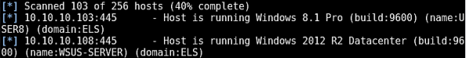

# Advance Active Directory Recon and Enumeration (RedTeam Edition)

A RedTeam member will usually identify misconfigurations or exploit trust relationships which will take him all the way to domain administrator. To achieve this, stealthy and extensive reconnaissance and enumeration are required.

# Traditional Approach
This approach we usaually apply during Active Directory peneration testing activies.

## Windows Domain Reconnaissance and Enumeration
1. Using a sniffer or a network scanning tool.
2. Through a non-domain joined Linux machine, without windows shell.
3. Through a domain joined windows machine.
---
### Recon & Enumeration using sniffer or a network scanning tool

Using Sniffer and passively sniffing traffic, we can stumble upon SNMP community strings, hostnames or domain names and ARP traffic being broadcasted.
> Wireshark and tcpdump have proven to be effective for this task.

As far as scanning is concerned, Nmap can do the work.
> It should be noted that the majority of Nmap-derived scans will be picked up by the IDS solution.

---

### Recon and Enumeration through a non-domain joined Linux System, without a windows shell

**Target Identification**<br>
To identify some target, we can start recon and Enum activity by firing up `nbscan` against the organization's IP ranges.
```bash
nbscan -r <Target range>
```

we can perform reverse DNS queries to identify hostname using Nmap
```bash
nmap -sL <Target or Range>
```

Also we can run Metasploit's `smb_version` module again the domain


**Leveraging SNMP**<br>
Metasploit's SNMP scanner attempts to guess the community string, If not acquired already via sniffing

```bash
use auxiliary/scanner/snmp/snmp_login
```

The community string can be acquired through sniffing if SNMPv1 or SNMPv2 are in use.

`Ettercap` can capture the community string by executing a MITM attack. It should be noted that in order to identify the address of the NMS interacting with the SNMP agent, you will have to add the `-p [PCAPFILE]` argument.

We can enumerate System running SNMP, Under the hood a Management Base (MIB) walk is perfomed for the enumeration.

[SNMPcheck](https://www.nothink.org/codes/snmpcheck/) can assist us in that.

```powershell
snmpcheck.ps1 -c <community_string> -t <IP>
```

**Dig Recon**<br>
Using `dig` we can try look up the Windows global catalog (GC) record and the authoritative domain server record to determine DC address

```bash
dig -t NS <domain_name>
OR
dig _gc. <domain_name>
```

**SMB (& NULL Sessions)**<br>
We can perform enumeration activities against the targeted  domain with a valid set of credentials or over a NULL session over SMB sessions.

> This kind of enumeration does not require a Windows shell.

Even though NULL sessions are becoming extinct they can still be met and leveraged to acquire a great amount of information. 
If this is not the case, any valid set of domain credentials will be enough to start our enumeration activities against the domain, without a Windows shell.

- A Valid set of domian credentials to perform enumeration activity again domain over SMB, using rpcclient

```bash
rpcclient -U <username> <IPADDRESS>
```

- For NULL Sessions, accompanied by an empty password.

```bash
rpcclient -U "" <IPADDRESS>
```

- To identify the accessible machines in range and then perform enumeration activites over an SMB authenticated session, we can do that using *rpcclient*.

```bash
cat ip.txt | while read line
> do
> echo $line && rpclient -U "<DOMAIN>\<USERNAME>%<PASSWORD>" -c "enumdomusers;quit" $line
> done
```

- To get information of the remote server execute

```bash
rpcclient > svrinfo
```

- To enumerate domain user execute

```bash
rpcclient > enumdomusers
```

- To enumerate domain and built-in groups execute

```bash
rpcclient > enumalsgroups domain
rpcclient > enumalsgroups builtin
```

- To identify a SID we can use the for a user or group

```bash
rpcclient > lookupnames <username> OR <groupname>
```

- Get detail of user having specific RID's, To identify the original user on a windows machine

```bash
rpcclient > queryuser 500
```

We can leverage more tools to enumerate **SMB** share, we can gather great amount of information through SMB Session. Some tools for that are `enum4linux`,`smbmap` and `nmap "smb-enum-shares"` script.

- To enumerate all shares of machine (required credentials)

```bash
smbclient -U "<DOMAIN>/<USERNAME>%<PASSWORD>" -L <HOSTNAME>
```

**Defeating Anonymous user restriction**<br>
The `RestrictAnonymous` registry key is one of the obstacles that impose anonymous user to connect **SMB**.

`RestrictAnonymous` bypass technique is not likely to work on modern windows enviroment, it may pay dividends on enviroments containing legacy systems.

The `RestrictAnonymous` bypass technique we are talking about is called `Anonymous SID to username translation` and its enable us to perform perform username enumeration though SID walk, which takes place in the backgroud.

To automate this process for us is [dumpusers](https://vidstromlabs.com/freetools/dumpusers/)

> SNMP is another route we can follow in our attempts to bypass anonymous restriction and continue our enumeration activities. Bear in mind we need to identify the community string for this Task. At the end of our endeavours we would like to put ourselves inside the "Authenticated Users" group. To do this any valid set of credential will do.

### Recon and Enum through a domain joined windows machine


**DC Discovery**<br>
1. To get the DC from SRV record by DNS query
```PowerShell
> nslookup -querytype=SRV _LDAP._TCP.DC._MSDCS.<domainname>
```

2. Using ADSI(PowerShell) for DC Discovery (Recommended)
```PowerShell
> [System.DirectoryServices.ActiveDirectory.Domain]::GetCurrentDomain().DomainControllers
```

3. Using `nltest` for DC Discovery
```PowerShell
> nltest /Server:<SERVERNAME> /dclist:<DOMAIN_NAME>
```

**Domain Discovery**<br>
1. using `net` command It return workgroup and domains on the network
```PowerShell
> net view /domain
```

2. Get member System of domain and workgroups
```PowerShell
> net view /domain:<DOMAIN_NAME>
```

**Host Discovery**<br>
We can identify hostnames via DNS, **We should also check for any zone transfer**

```PowerShell
> nslookup <IP_ADDRESS>
```

> *Be aware that any interaction with DNS system can be easily spotted*

1. Discovery Endpoint Enumerate through DNS
```PowerShell
for /L %i in (1,1,255) do @nslookup 10.10.10.%i 2>nul | find "Name" && echo 10.10.10.%i
```

2. Host discovery using nbstat
```PowerShell
> nbstat -A <Remote_Machine_Ip>
```

Return a remote machine's MAC Addess, hostname and domain membership, as well as codes that  represent roles it perform in the enviroment (DC, IIS, Database etc) through NetBIOS over TCP/IP statistics, NetBIOS Name table (Include local and remote computers) and NetBIOS name cache

```cmd
for /L %i in (1,1,225) do @nbstat 10.10.10.%i 2>nul && echo 10.10.10.%i
```