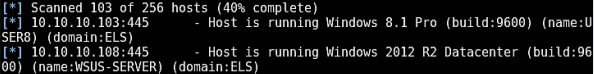

# Advance Active Directory Recon and Enumeration (ReadTeam Edition)

A RedTeam member will usually identify misconfigurations or exploit trust relationships which will take him all the way to domain administrator. To achieve this, stealthy and extensive reconnaissance and enumeration are required.

### Traditional Approach
This approach we usaually apply during Active Directory peneration testing activies.

#### Windows Domain Reconnaissance and Enumeration
1. Using a sniffer or a network scanning tool.
2. Through a non-domain joined Linux machine, without windows shell.
3. Through a domain joined windows machine.
---
##### 1. Recon & Enumeration using sniffer or a network scanning tool

Using Sniffer and passively sniffing traffic, we can stumble upon SNMP community strings, hostnames or domain names and ARP traffic being broadcasted.
> Wireshark and tcpdump have proven to be effective for this task.

As far as scanning is concerned, Nmap can do the work.
> It should be noted that the majority of Nmap-derived scans will be picked up by the IDS solution.

---

##### 2. Recon and Enumeration through a non-domain joined Linux System, without a windows shell

**Target Identification**
To identify some target, we can start recon and Enum activity by firing up `nbscan` against the organization's IP ranges.
```
nbscan -r <Target range>
```

we can perform reverse DNS queries to identify hostname using Nmap
```
nmap -sL <Target or Range>
```

Also we can run Metasploit's `smb_version` module again the domain


**Leveraging SNMP**
Metasploit's SNMP scanner attempts to guess the community string, If not acquired already via sniffing
```
use auxiliary/scanner/snmp/snmp_login
```

The community string can be acquired through sniffing if SNMPv1 or SNMPv2 are in use.

`Ettercap` can capture the community string by executing a MITM attack. It should be noted that in order to identify the address of the NMS interacting with the SNMP agent, you will have to add the `-p [PCAPFILE]` argument.

We can enumerate System running SNMP, Under the hood a Management Base (MIB) walk is perfomed for the enumeration.

[SNMPcheck](https://www.nothink.org/codes/snmpcheck/) can assist us in that.
```
snmpcheck.ps1 -c <community_string> -t <IP>
```
**Dig Recon**
Using `dig` we can try look up the Windows global catalog (GC) record and the authoritative domain server record to determine DC address
```
dig -t NS <domain_name>
OR
dig _gc. <domain_name>
```

**SMB (& NULL Sessions)**
We can perform enumeration activities against the targeted  domain with a valid set of credentials or over a NULL session over SMB sessions.
> This kind of enumeration does not require a Windows shell.

Even though NULL sessions are becoming extinct they can still be met and leveraged to acquire a great amount of information. 
If this is not the case, any valid set of domain credentials will be enough to start our enumeration activities against the domain, without a Windows shell.

A Valid set of domian credentials to perform enumeration activity again domain over SMB, using rpcclient
```
rpcclient -U <username> <IPADDRESS>
```

For NULL Sessions, accompanied by an empty password.
```
rpcclient -U "" <IPADDRESS>
```